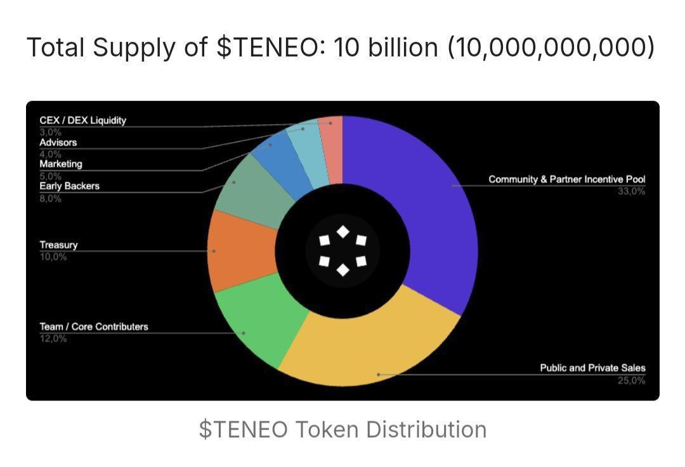

# TENEO EXTENSION NODE BOT



## Table Of Contents
- [TENEO EXTENSION NODE BOT](#teneo-extension-node-bot)
  - [Table Of Contents](#table-of-contents)
  - [Prerequisite](#prerequisite)
  - [Join My Telegram Channel](#join-my-telegram-channel)
  - [BOT FEATURE](#bot-feature)
  - [TENEO EXTENSION NODE AIRDROP](#teneo-extension-node-airdrop)
  - [Setup \& Configure BOT](#setup--configure-bot)
    - [Linux](#linux)
    - [Windows](#windows)
  - [Update Bot](#update-bot)
  - [IMPORTANT NOTE (READ IT THIS IS NOT DECORATION)](#important-note-read-it-this-is-not-decoration)
  - [CONTRIBUTE](#contribute)
  - [SUPPORT](#support)

## Prerequisite
- Git
- Node JS (v22)

## Join My Telegram Channel
```
                                                          
                      ...                                 
                     .;:.                                 
                    .;ol,.                                
                   .;ooc:'                                
            ..    .;ooccc:'.    ..                        
          .',....'cdxlccccc;.....,'.                      
         .;;..'';clolccccccc:,''..;;.                     
        ':c'..':cccccccccccccc;...'c:.                    
       ':cc,.'ccccccccccccccccc:..;cc:'                   
    ...:cc;.':cccccccccccccccccc:..:cc:...                
   .;';cc;.':;;:cccccccccccccc:;;;'.;cc,,;.               
  .cc':c:.',.....;cccccccccc;.....,..:c:'c:               
  ,x:'cc;.,'     .':cccccc:'.     ',.;cc':x'              
  lO,'cc;.;,       .;cccc:.       ,;.;cc';0l              
 .o0;.;c;.,:'......',''''''......':,.;c;.:0l.             
 .lxl,.;,..;c::::;:,.    .,:;::::c;..,;.,oxl.             
 .lkxOl..  ..'..;::'..''..'::;..'..  ..c0xkl.             
  .cKMx.        .;c:;:cc:;:c:.        .xMKc.              
    ;KX:         ;o::l:;cc;o:.        ;KK;                
     :KK:.       ,d,cd,'ol'o:       .:0K:                 
      ;0NOl:;:loo;. ... .. .;ldlc::lkN0:                  
       .lONNNKOx0Xd,;;'.,:,lKKkk0XNN0o.                   
         .','.. .lX0doooodOXd.  .','.                     
                 .,okkddxkd;.                             
                    'oxxd;.                               
   ........................................                              
   .OWo  xNd lox  xxl Ald   xoc dakkkkkxsx.              
   .OWo  o0W cXW  dM0 MMN   lNK laddKMNkso.               
   .kMKoxsNN oWX  dW0 MMMWO lWK    axM0   .                
   .OMWXNaMX dM0  kM0 MMKxNXKW0    axMk   .                 
   .OMk  dWK oWX XWdx Mxx  XMMO    akMx   .                 
   'OWo  dM0 'kNNXNNd DMD   OWk    aoWd   .                 
   ........................................

```           
                                              
                                              

Anyway i create new telegram channel just for sharing bot or airdrop, join here
[**https://t.me/skeldrophunt**](https://t.me/skeldrophunt).


## BOT FEATURE
- Multi Account 
- Proxy Support (HTTP / SOCKS5)
- Auto Run Teneo Node


## TENEO EXTENSION NODE AIRDROP
#NEW 

Airdrop
New Airdrops: Teneo Node Ektension 

Hope im not late enough 😂
➡️ Download Extension : https://chromewebstore.google.com/detail/teneo-community-node/emcclcoaglgcpoognfiggmhnhgabppkm
- Install Extension
- Login / Create Account
- Enter Ref Code : ```wi3fG```  (USE REF GOT 2500 Points)
- Verify Email
- Run Nodes Ektension 
- LFG


## Setup & Configure BOT

### Linux
1. Clone project repo
   ```
   git clone https://github.com/Widiskel/teneo-node-bot.git && cd teneo-node-bot
   ```
2. Run
   ```
   npm install && npm run setup
   ```
3. Configure your accounts
   ```
   nano accounts/accounts.js
   ```
4. Configure the bot config
   ```
   nano config/config.js
   ```
5. Configure the proxy
   ```
   nano config/proxy_list.js
   ```
6. Run Bot
   ```
   npm run start
   ```
   
### Windows
1. Open your `Command Prompt` or `Power Shell`.
2. Clone project repo
   ```
   git clone https://github.com/Widiskel/teneo-node-bot.git && cd teneo-node-bot
   ```
3. Run 
   ```
   npm install && npm run setup
   ```
5. Navigate to `teneo-node-bot` directory. 
6. Navigate to `accounts` folder and rename `accounts_tmp.js` to `accounts.js`.
7. Now open `acccounts.js` and setup your accounts.
8. Navigate to `config` and adjust the `config.js` as needed.
9. Also Configure proxy if you want to use proxy, by open `proxy_list.js`. (if you have 5 accounts, proxy is required)
10. Back to `teneo-node-bot` directory.
11. To start the app open your `Command Prompt` or `Power Shell`
12. Run Bot
    ```
    npm run start
    ```

## Update Bot

To update bot follow this step :
1. run
   ```
   git pull
   ```
   or
   ```
   git pull --rebase
   ```
   if error run
   ```
   git stash && git pull
   ```
2. run
   ```
   npm update
   ```
2. start the bot


## IMPORTANT NOTE (READ IT THIS IS NOT DECORATION)

DWYOR

How can I get Teneo Points?
Reward distribution varies based on your contribution. You can collect Teneo Points through connecting your Node or inviting new people to our network. The points are distributed as the following:

Invite a Friend
Points per Referral	
5,000	
Points per Invitee
2,500

Node Connectivity
Points per Heartbeat
25
Max Points per Day
2,400

*Points are credited when the invitee has 10 successful heartbeats.
**Each hour consists of 4 heartbeats that evaluate if your Node is connected and successfully running. Please note that the points model can change at any time.

Teneo Using Web Socket, so make sure you only run 1 accounts session, example if you run bot using account A, dont run account A on your browser extension.

**USE PROXY IF YOU RUN MULTIPLE ACCOUNTS**

## CONTRIBUTE

Feel free to fork and contribute adding more feature thanks.

## SUPPORT

want to support me for creating another bot ?
**star** my repo or buy me a coffee on

EVM : `0x1f0ea6e0b3590e1ab6c12ea0a24d3d0d9bf7707d`

SOLANA : `3tE3Hs7P2wuRyVxyMD7JSf8JTAmEekdNsQWqAnayE1CN`
